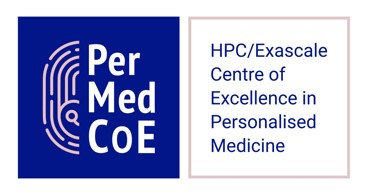
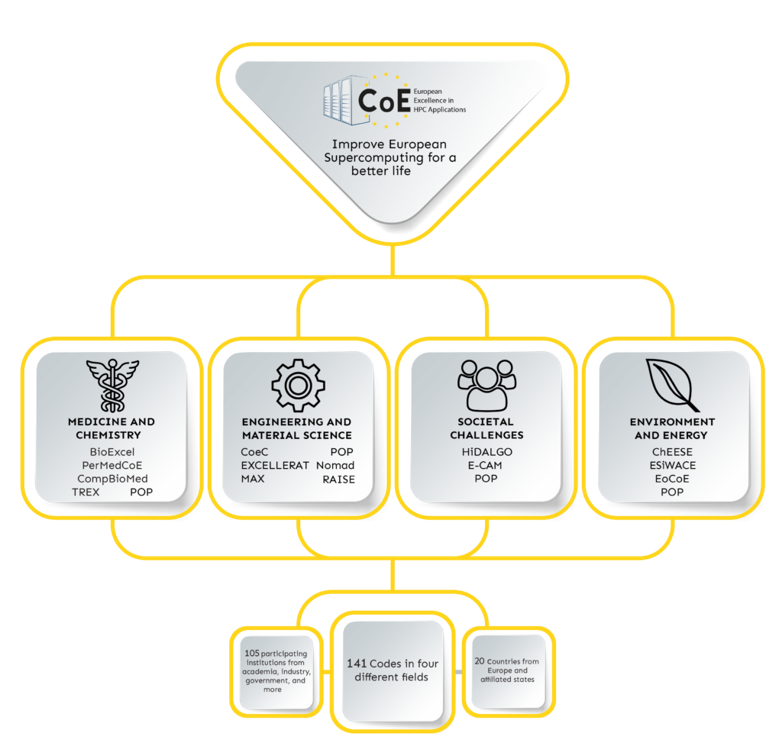
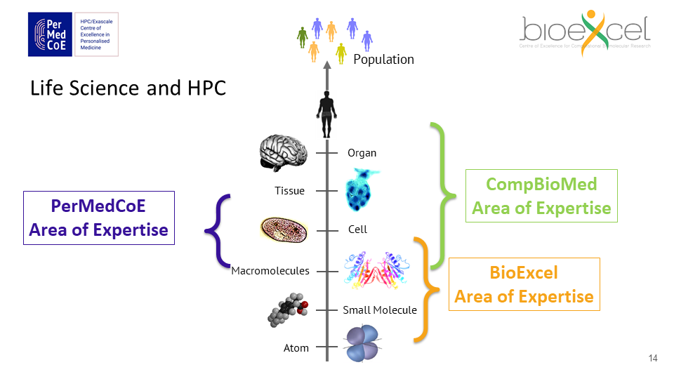
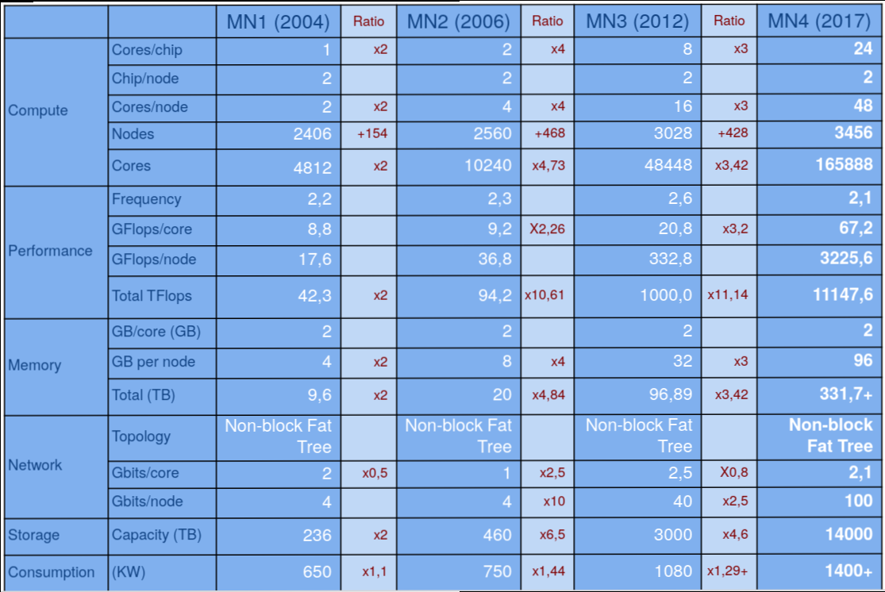

# Introducción al HPC (High-Performance Computing)

## Los organizadores

Son dos de los [Centros de Excelencia europeos para las aplicaciones HPC](https://www.hpccoe.eu/eu-hpc-centres-of-excellence2/), iniciativa de la UE por medio de la cual busca promover el uso de HPC.

+ **Centre of Excellence in Personalised Medicine (PerMedCoE)**

+ **Centre of Excellence for Computational Biomolecular Research (BioExcel)**

+ **Barcelona Supercomputing Center (BSC)**

<!-- -->

>  BioExcel and the PerMedCoE projects have received funding from the European Union’s Horizon 2020 research and innovation programme under the grant agreements 823830 & 675728 and 951773, respectively. BioExcel is also funded  by the EuroHPC Joint Undertaking and Sweden, Netherlands, Germany, Spain, Finland and Norway under grant agreement 101093290

## Qué otros Centros de Excelencia hay y que áreas abarcan?

### Sus funciones

+ Software development
+ Workflows and usability
+ Community support
+ Training ([competency-based](https://competency.ebi.ac.uk))
+ Customisation and consultancy
+ Dissemination 

## Y la epidemiología?

+ Otro Centro de Excelencia HPC: **Computational Biomedicine (CompBioMed)**

> **To and from the clinic:** We will manage and provision access to personal (patient specific) derived medical data in a research environment. We also need to perform high fidelity 3D and 4D HPC based simulations and, at the sharp end, provide clinical decision support within very short timeframes (often minutes, hours or a few days).

> **Medical data:** The rapid rise of detailed medical imaging, genomic data, abundant proteomic, metabolomic, biological, and physiological data on all levels of biological organisation (macromolecules, cells, tissues, organs, organ systems, the whole body and, indeed, epidemiology), permits the development of mathematically based, mechanistic and predictive multiscale models of human health and disease. The software tools and techniques that we develop within CompBioMed will help healthcare providers to make sense of the vast array of data now available, and will have a major impact on the clinical decision making process.

+ El proyecto CINECA ([https://www.cineca-project.eu](https://www.cineca-project.eu)), que por ejemplo tiene entre los colaboradores a EMBL-EBI y al centro finlandés de supercomputación CSC-IT, a su vez entidades colaboradoras de BioExcel y PerMedCoE respectivamente.
 
> Accelerating disease research and improving health by facilitating transcontinental human data exchange

# Sumario

El curso consistió en un conjunto de presentaciones independientes y en sesiones de uso práctico de los superordenadores MareNostrum 4 y CTE Power9. 

En ambos casos, las primeras horas abordaron una introducción a los superordenadores -en concreto a los alojados en el BSC- y a su uso (cómo conectarse, nociones básicas de uso), tras las cuales vimos ejemplos de aplicaciones prácticas en las áreas de la biología celular ([http://physicell.org](http://physicell.org)) y la química molecular ([https://www.gromacs.org](https://www.gromacs.org)) y también el ejemplo de una utilidad ([COMP Superscalar](https://www.bsc.es/research-and-development/software-and-apps/software-list/comp-superscalar/)) desarrollada para facilitar el trabajo con estas plataformas.

## Conceptos básicos de HPC

### Hardware

En un ordenador común:

+ 1 (o 2) zócalos con 4, 8 o 16 cores cada uno
+ Memoria RAM de 16/32 o 64 GB
+ Disco duro SSD de hasta 2 TB
+ GPU (habitualmente integrada) para procesamiento gráfico

En un cluster HPC esto cambia, por ejemplo en el MareNostrum 4:

+  2 zócalos con 24 cores cada uno
+ Memoria RAM de 96/385 GB por nodo (cluster MN4 = 3456 nodos)
+ Disco duro SSD de hasta 240 GB

### HPC en el BSC

[MareNostrum 4](https://www.bsc.es/es/marenostrum/marenostrum)

Se divide en 2 bloques:

+ Bloque de propósito general:
    - 3456 nodos. Cada nodo tiene 2 chips con 24 procesadores cada uno
+ Bloque de tecnologías emergentes, formado por 3 clústeres:
    - MN4 CTE-AMD, formado por procesadores AMD Rome y AMD Radeon Instinct MI50.
    - MN4 CTE-Power, constituido por procesadores IBM POWER9 y GPUs NVIDIA Volta
    - MN4 CTE ARM, compuesto por procesadores 64 bit ARMv8.

+ MareNostrum 5 --> 2023
> The acquisition and operation of the EuroHPC supercomputer is funded jointly by the EuroHPC Joint Undertaking, through
the European Union’s Connecting Europe Facility and the Horizon 2020 research and innovation programme, as well as the
Participating States Spain, Portugal, Croatia, and Turkey
 
+ [Minotauro](https://www.bsc.es/es/marenostrum/minotauro). 38 nodos con 2 procesadores por nodo, 8 cores por procesador
+ Nord3v2
+ ...

### Software

Sistemas operativos Linux.

#### Cómo conectarse

Por medio de las tecnologías `ssh` y `scp` (por ejemplo, son las mismas que utilizamos para conectarnos a los servidores de Opal, donde están las bbdd de ATHLOS y MindCovid-Respond).

## Por qué y cómo el HPC puede beneficiar tú investigación?

+ En un ordenador común los programas operan secuencialmente en un único procesador (CPU)
+ Si la ejecución de un programa se puede dividir en partes que puedan ser realizadas simultáneamente/en paralelo, su ejecución puede beneficiarse de las múltiples CPUs y demás características en un HPC, obteniendo, entre otros:
    - Ahorro de tiempo
    - Posibilidad de resolver problemas enormes imposibles con un único procesador (por el tiempo y la memoria requeridos)
    - Posibilidad de resolver múltiples problemas independientes simultáneamente

## Recursos

+ The European High Performance Computing Joint Undertaking (EuroHPC JU) [https://eurohpc-ju.europa.eu/index_en](https://eurohpc-ju.europa.eu/index_en)
    - [Access to our supercomputers](https://eurohpc-ju.europa.eu/participate/access-our-supercomputers_en)
> Researchers from academia, research institutes, public authorities, and industry established or located in an EU Member State or in a country associated with Horizon 2020 can now apply and access the EuroHPC supercomputers
+ Red Española de Supercomputación (RES) [https://www.res.es](https://www.res.es)